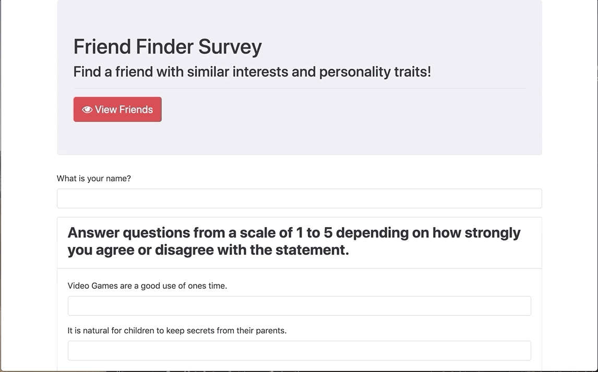

# FriendFinder

This is a compatibility-based "FriendFinder" application -- basically a dating app. This full-stack site takes in results from users' surveys, then compares their answers with those from other users. The app will then display the name and point differential of the user with the best overall match.
The app uses Express to handle routing. 

The survey has 10 questions. Each answer should be on a scale of 1 to 5 based on how much the user agrees or disagrees with a question.

